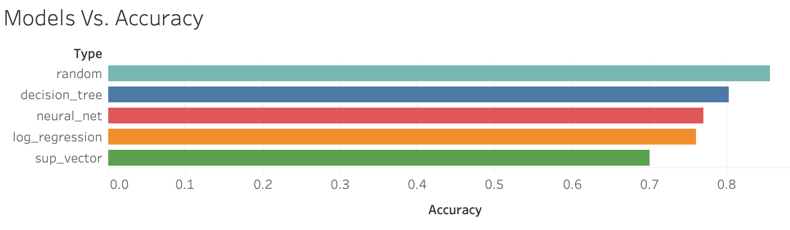
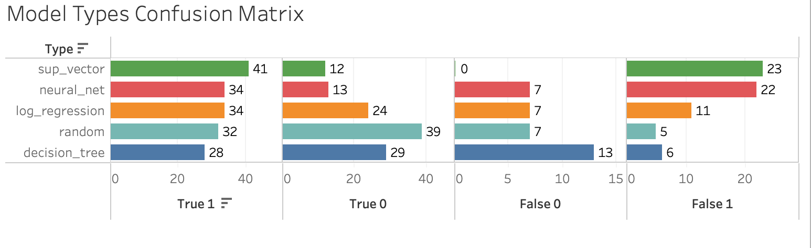

# This_Data_is_Off_the_cHearts
Table of Contents

1. [Introduction](#introduction)
2. [Objective](#objective)
3. [Installation](#installation)
4. [Model Performance](#modelperformance)
5. [Best Models Analysis](#bestmodelsanalysis)
6. [Visualizations](#visualizations)
7. [References](#references)

## Introduction

Cardiovascular disease or heart disease describes a range of conditions that affect your heart. Diseases under the heart disease umbrella include blood vessel diseases, such as coronary artery disease. From WHO statistics, every year, 17.9 million die from heart disease

The Cleveland dataset was defined, cleaned, and analyzed to answer pertinent questions that are vital to human life as regards the possibility of a heart attack. This dataset stemmed from a survey donated on 7/1/1988. However, this could serve as a template for learning why individuals could have a heart attack. 

## Objective 

We plan on using the heart attack prediction dataset to create multiple machine learning models. We will then analyze the models based on multiple criteria to find which were the best fit for this data set

## Model Performance

In terms of accuracy of the model, random forrests and decision trees performed the best.

As for the confusion matrix, where we see the models performance in correctly predicting the 1 and 0 values, random forrests and logistigc regression performed best. 
