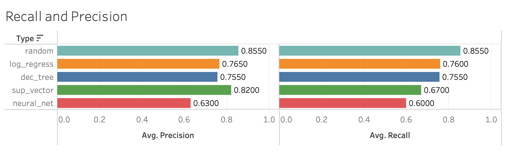
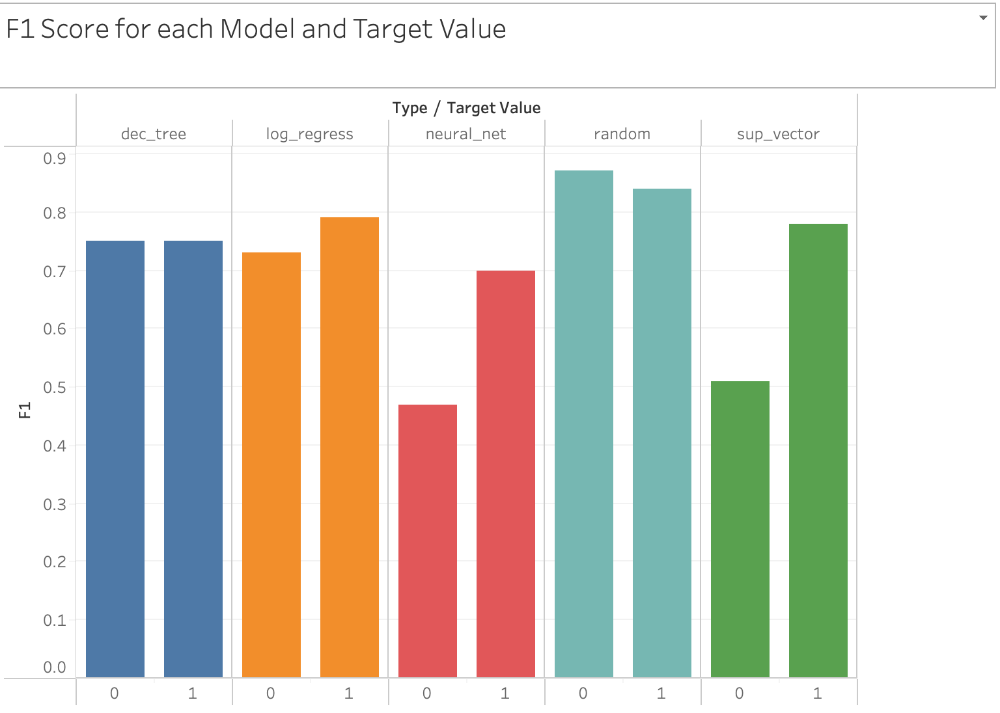

# This_Data_is_Off_the_cHearts
Table of Contents

1. [Introduction](#introduction)
2. [Objective](#objective)
3. [Installation](#installation)
4. [Model Performance](#modelperformance)
5. [Best Models Analysis](#bestmodelsanalysis)
6. [Visualizations](#visualizations)
7. [References](#references)

## Introduction

Cardiovascular disease or heart disease describes a range of conditions that affect your heart. Diseases under the heart disease umbrella include blood vessel diseases, such as coronary artery disease. From WHO statistics, every year, 17.9 million die from heart disease

The Cleveland dataset was defined, cleaned, and analyzed to answer pertinent questions that are vital to human life as regards the possibility of a heart attack. This dataset stemmed from a survey donated on 7/1/1988. However, this could serve as a template for learning why individuals could have a heart attack. 

## Objective 

We plan on using the heart attack prediction dataset to create multiple machine learning models. We will then analyze the models based on multiple criteria to find which were the best fit for this data set

## Model Performance

In terms of accuracy of the model, random forrests and decision trees performed the best.

As for the confusion matrix, where we see the models performance in correctly predicting the 1 and 0 values, random forrests and logistigc regression performed best. 

Recall and Precision give performance metrics to the confusion matrix. Recall is the true positive rate, foung using the formula: recall= TP/(TP+FN). Precision on the other hand, refers to the proportion of true positive values out of all the predicted vales. Precison uses the formula: Precision= TP/(TP+FP)

In the case of our models, random forrests, logistic regression and decision trees were the top performers.

F1 score is a harmonic, balanced mean between the recall and precision scores. Using the formula, F1 Score = 2 * (Precision * Recall) / (Precision + Recall), the F1 score gives a more equal weight to both scores. For our models, again random forrests, logistic regression and decision trees were the top performers.

Despite how promising logistic regression was from the perfomance metrics, its accuracy was never as good as decision tree and random forrest. In the end, we chose the decision trees and random forrest as our two models which could best predict the heart attack data!

## Best Models Analysis
